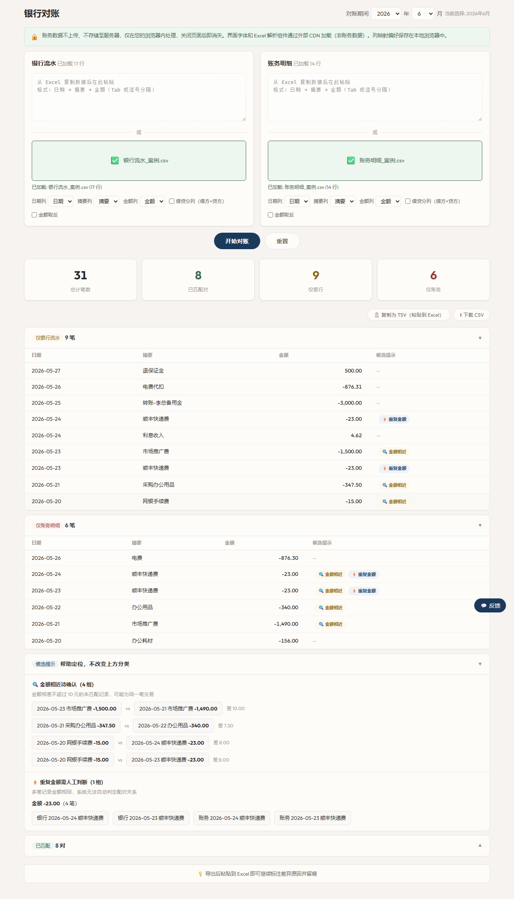
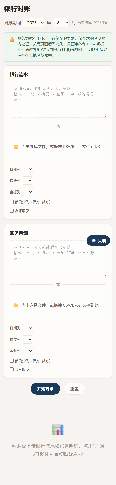
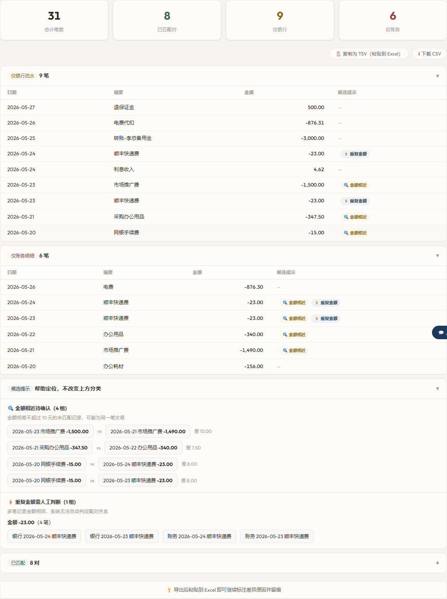

# 月底对账35分钟变3分钟：上传两个文件，8处差异2秒钟全标出来

早上中午晚上好啊朋友们，我天机顽童又来赛博炼丹了。

你每个月的重复劳动，就是我的待办清单。

你玩过"大家来找茬"吗，两张几乎一样的图，让你找出不同。每个月末的银行对账，就是这个游戏的无限续杯版。

月末最后一天下午四点。左边Excel开着银行流水，右边Excel开着账务明细。

17条银行记录，14条账务记录。左手Alt+Tab来回切，右手食指指着屏幕一行一行往下移：金额对金额、日期对日期、摘要瞄一眼。移到第11行的时候——忽然想不起前面10行看了什么。翻回去。再从第1行开始。

电费这一行。银行扣了876.31元，账务记了876.30元。

差1分钱。

1分钱。银行跨行转账手续费都不止这个数。但它就卡在中间——两边不平，你没法跳过。最笨的手工排查要逐条去对，接近238个组合。等找到这一分钱的来源，十几分钟过去了。如果类似的差异有七八处？一个下午。

这还只是8处差异里的其中1处。我不想忍了——让AI写了个对账工具。上传两个文件，8处差异2秒钟全标出来。不是为了什么"智能化"，就是不想每个月再一行行拿手指头对。

---

## 先看结果

同一组数据，17条银行流水+14条账务明细：

手动对账花了35分钟。工具呢？3分钟。差了11.7倍。

上传两个文件，点完对账约2秒出结果。11对自动匹配，8处差异全给标出来了——包括那笔差1分钱的电费。哪条只有银行有、哪条只有账务有、哪条两边都有但金额对不上……一清二楚。

对完那一瞬间——不用掐着眉心一行行盯了。所有差异整整齐齐列在下面，一条都跑不掉。

> 所有对账计算在浏览器本地完成，数据不上传任何服务器。

## 怎么用

打开 https://bank.tianjiwantong.com.cn 。没注册、没登录。页面就两个输入区：

上面是粘贴区——从Excel复制数据直接贴进来。

下面是上传区——CSV文件或者Excel文件往里一拖就行。常见格式工具会自动识别，如果格式比较特殊也可以手动调整列映射。

列的对应关系自动识别好了——日期、摘要、金额——大多数情况下不需要你手动调。点一下"开始对账"。

约2秒。

出来的结果分两块：上面绿色对勾的是匹配成功的，你基本不用看。下面橙色标记的是差异项——这些才是你要盯的。

## 拿一组数据跑一遍看看

文末附了两组CSV数据，复制粘贴到工具里就能复现上面说的所有结果。当然你也可以用自己的银行流水和账务明细直接上手——更真实。

银行流水17条，账务明细14条。对完：11对精确匹配，8处差异。

（8处差异里，4对是两边都有但金额或日期对不上，3条只有银行有，1条只有账务有——这么拆开说，数字关系就清楚了。）

重点不是这些具体的数字——是差异的类型。这种"一头有另一头没有""金额差不多但又差几块钱""日期差一两天"的情况，跟公司大小一毛钱关系都没有，每个月都在发生。

**差1分钱的电费。** 银行扣了876.31元，账务记了876.30元。手工查的时候怀疑的是自己眼睛花了，翻回去看了三遍。最后找到原始单据：入账手误，按错了。

**差10元、日期还差2天的推广费。** 银行5月23日扣了1500元，账务5月21日记了1490元。金额和日期都不一样——手工对账大概率被当成"两笔不同的交易"直接滑过去。月底发现差10块钱，回头再找：哪笔对哪笔？不记得了。

**日期差一天的工资。** 银行5月27日付了18600元，账务5月26日就计提了。跨行转账延迟一天太正常了——但手工对账看到日期对不上，你就得多看两眼，确认这确实是同一笔。

**只有一边有记录的。** 退保证金500元——银行收到了，账务没记。老板备用金转了3000元——银行扣了，账务不知道。网银手续费扣了15元——银行扣了，账务没提。反过来，有一笔办公耗材156元——账务记了，银行根本就没发生过。

这些差异每一条手工查都是"翻凭证→打电话→等回复"的循环。3000块老板私账转账这种事，不问都不知道。

工具一次性全标出来了。拿着清单逐条核实——该补凭证的补凭证，该打电话的打电话。起码不用先花半个下午把差异找出来。

## 一键导出，拿去交差

点"导出差异清单"，所有异常项打包成一个CSV。

每条差异标注了类型——"金额不一致""日期不一致""仅银行""仅账务"。你拿着这份清单去翻原始凭证，一找一个准。

导出之前不用手动整理、不用画线、不用标注颜色。就一个按钮的事。这可能是整个工具里我最满意的功能——不是因为技术含量高，是因为它省掉的是最没技术含量但最磨人的那步。

---

## 开发踩过的几个坑

写这个工具的过程中翻了几次车。挑两个有代表性的说。

**坑1：上传文件直接白屏。** CSV文件读进来是ArrayBuffer，不是字符串。我拿它直接去调字符串的方法——浏览器崩了。花了一个小时排查，最后发现是数据类型搞错了。文件上传不是"拿到文件就完事了"，每一步都得搞清楚你现在手里是什么类型的数据。

**坑2：上次选了"金额在第3列"，工具记住了。** 下次换了新文件——工具还是去读第3列，但那列是日期。因为我保存了用户的列设置，但换文件的时候没去检查"这个文件的第3列还是金额吗？"修起来不复杂——上传新文件的时候做一次表头指纹校验。但这背后有一条通用教训：保存了设置 ≠ 下次还能用。上下文变了，存的东西就过期了。

## 数据安全

> 所有匹配计算在浏览器本地完成，数据不上传任何服务器。
>
> 工具是辅助排查用的，最终确认以银行回单、原始凭证和会计判断为准——它帮你省掉找差异的时间，不是替你签字。

---

说到底，对账这件事比的不是谁眼睛好、谁有耐心——比的是谁手里有工具。

两个文件，上传，2秒。8处差异全标出来。35分钟变成3分钟。差的那32分钟不是效率，是月末最后一天下午那杯本来不用凉的咖啡。

现在就试试。打开 https://bank.tianjiwantong.com.cn 直接上手。完全免费。

评论区聊聊：你每个月对账要花多长时间？有没有为了几分钱查过半天的经历？

报销、台账、票据整理类工具也会陆续做出来——点个关注，下次更新你就能收到。

---

如果你对AI编程感兴趣，欢迎关注我们，获取更多好玩有趣的玩法。

---

### 附：案例数据

复制以下内容分别保存为 CSV 文件，上传到工具即可复现文中的对账结果。

**银行流水（bank.csv）**
日期,摘要,金额
2026-05-28,华星贸易货款到账,12800.00
2026-05-28,支付沪东供应商原料款,-5320.00
2026-05-27,退保证金,500.00
2026-05-27,支付5月工资,-18600.00
2026-05-26,咨询服务收入,3500.00
2026-05-26,电费代扣,-876.31
2026-05-25,物业费,-2200.00
2026-05-25,转账-李总备用金,-3000.00
2026-05-24,顺丰快递费,-23.00
2026-05-24,利息收入,4.62
2026-05-23,市场推广费,-1500.00
2026-05-23,顺丰快递费,-23.00
2026-05-22,报销退款,1200.00
2026-05-22,滴滴打车,-87.40
2026-05-21,采购办公用品,-347.50
2026-05-20,网银手续费,-15.00
2026-05-19,收客户定金,5000.00

**账务明细（accounting.csv）**
日期,摘要,金额
2026-05-28,华星贸易货款到账,12800.00
2026-05-28,支付沪东供应商原料款,-5320.00
2026-05-26,计提5月工资,-18600.00
2026-05-26,咨询服务收入,3500.00
2026-05-26,电费,-876.30
2026-05-25,物业费,-2200.00
2026-05-24,顺丰快递费,-23.00
2026-05-23,顺丰快递费,-23.00
2026-05-22,办公用品,-340.00
2026-05-22,报销退款,1200.00
2026-05-22,滴滴企业打车,-87.40
2026-05-21,市场推广费,-1490.00
2026-05-20,办公耗材,-156.00
2026-05-19,收客户定金,5000.00
